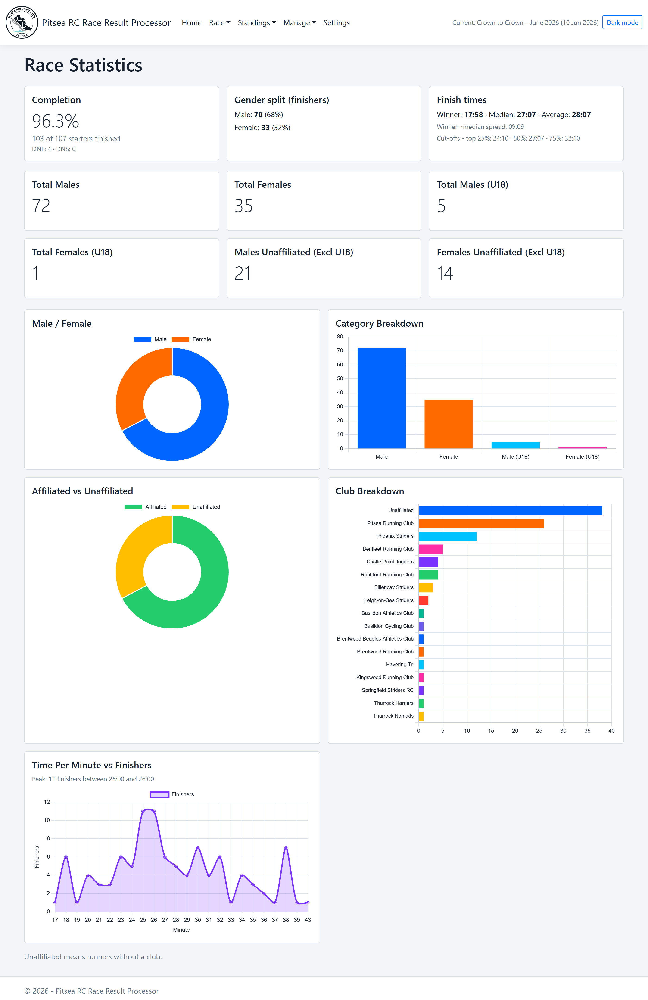
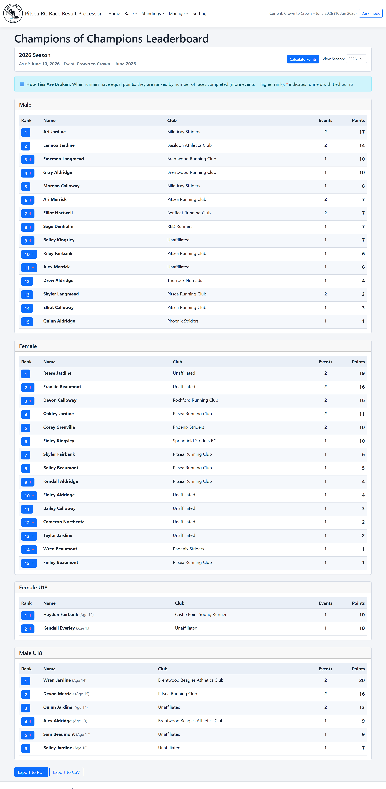
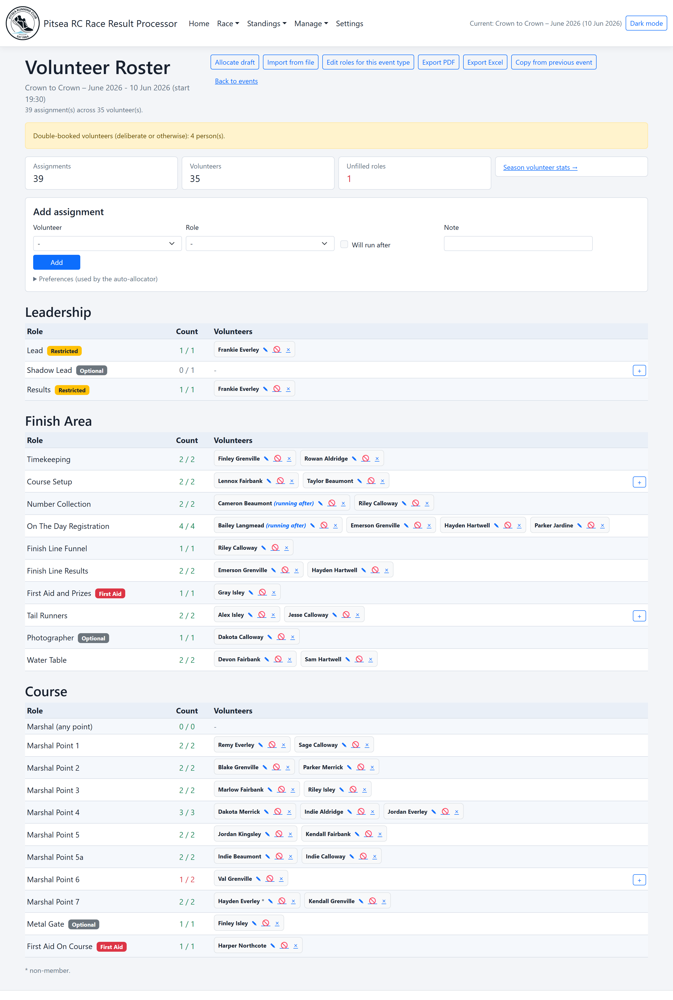

# Pitsea RC Race Result Processor

An ASP.NET Core MVC web application for processing race results, built for Pitsea Running Club. Race organisers upload entrant, finish, and timing data, then view, edit, and export the collated results. The app maintains the club's yearly **Champions of Champions** leaderboard across the Crown to Crown race series, and also manages the **volunteer roster** for each event — including a rules-based draft allocator, season-long volunteer recognition, and London Marathon ballot tracking.

## Screenshots

A quick look at the main features (using anonymised demo data). See the full [screenshot gallery](docs/screenshots.md).

| Race statistics | Champions leaderboard | Volunteer roster |
|---|---|---|
| [](docs/screenshots.md#race-statistics) | [](docs/screenshots.md#leaderboard) | [](docs/screenshots.md#volunteer-roster) |

## Prerequisites

- [.NET 10 SDK](https://dotnet.microsoft.com/download)

## Getting Started

```powershell
# Clone the repository
git clone <repo-url>
cd pitsea-rc-results-processing

# Run the web app
dotnet run --project .\RaceResults.Web\RaceResults.Web.csproj
```

Open the URL printed to the console (typically `http://localhost:5200` when using the default launch profile).

The SQLite database (`raceresults.db`) is created automatically on first run in the working directory.

For non-technical users, a pre-built Windows release is produced by [`installer/build-installer.ps1`](installer/build-installer.ps1) — see [installer/README.md](installer/README.md). Installed builds default to a per-user database location and don't need the .NET SDK.

### Logo assets

The shared layout expects the following logo files:

- `RaceResults.Web/wwwroot/images/pitsea-logo-white.png`
- `RaceResults.Web/wwwroot/images/pitsea-logo-black.png`

If these files are missing, the navbar logo will not render.

## Running the Tests

```powershell
# Run all tests
dotnet test .\pitsea-rc-results-processing.slnx

# Run unit tests only
dotnet test .\RaceResults.UnitTests\RaceResults.UnitTests.csproj

# Run integration tests only
dotnet test .\RaceResults.IntegrationTests\RaceResults.IntegrationTests.csproj

# Run with coverage
dotnet test .\pitsea-rc-results-processing.slnx --collect:"XPlat Code Coverage"
```

| Project | Tests | Approach |
|---|---|---|
| `RaceResults.UnitTests` | 264 | Services tested against isolated SQLite DBs per test |
| `RaceResults.IntegrationTests` | 26 | Full HTTP stack via `WebApplicationFactory<Program>` with in-memory SQLite |
| **Total** | **290** | |

## Technology Stack

| Component | Package |
|---|---|
| Web framework | ASP.NET Core MVC (.NET 10) |
| Database | SQLite via `Microsoft.EntityFrameworkCore.Sqlite` 10.0.7 |
| Excel parsing | `ClosedXML` 0.105.0 |
| CSV parsing | `CsvHelper` 33.1.0 |
| PDF generation | `QuestPDF` 2026.2.4 (Community licence) |
| Charts (client-side) | `Chart.js` 4.4.6 + `chartjs-plugin-datalabels` 2.2.0, bundled locally under `wwwroot/lib` so graphs render offline |
| Unit testing | xUnit 2.9.3 |
| Integration testing | `Microsoft.AspNetCore.Mvc.Testing` 10.0.7 |

## Documentation

Detailed reference lives in [`docs/`](docs/):

| Document | Covers |
|---|---|
| [Features](docs/features.md) | Full capability list |
| [Screenshots](docs/screenshots.md) | Visual tour of the main features |
| [Domain Conventions](docs/domain-conventions.md) | Club-specific rules the code relies on (ages, categories, finish status, series schedule, volunteer roles, ballot) |
| [Architecture & Project Structure](docs/architecture.md) | Project layout, architecture notes, and data persistence / reset rules |
| [Upload File Formats](docs/upload-formats.md) | Entrant, finish bib, and timing file layouts and validation |
| [Workflow](docs/workflow.md) | Step-by-step race, volunteer roster, and Champions sequences |
| [Champions of Champions](docs/champions.md) | Scoring, runner identity, schema, service layer, routes, and UI |
| [PDF Layout & Configuration](docs/pdf-and-config.md) | Race-day PDF format and `appsettings.json` settings |
| [User Stories](docs/user-stories.md) | Implemented-story index and dependency notes |
