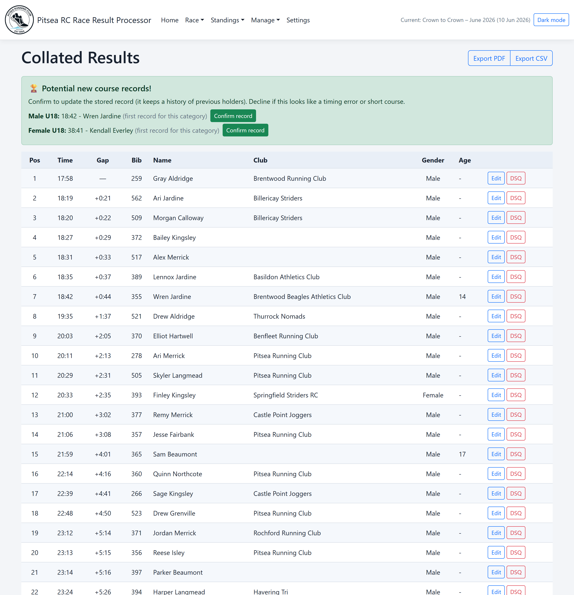
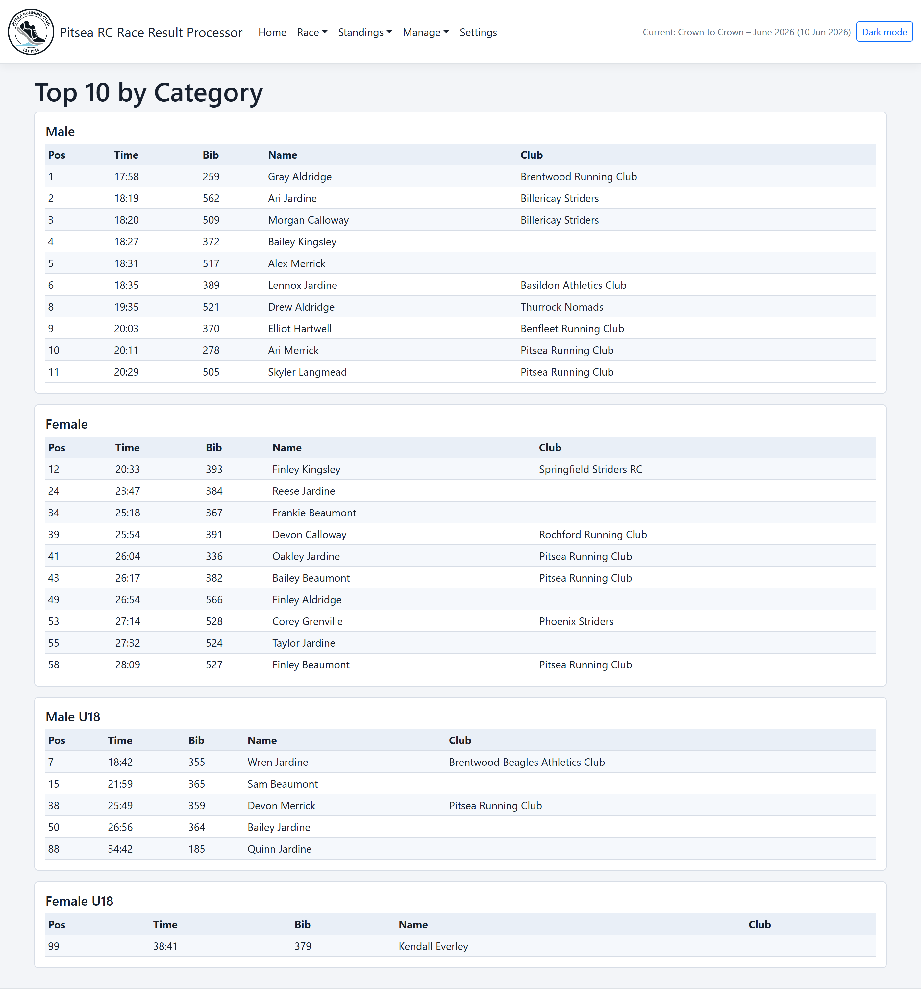
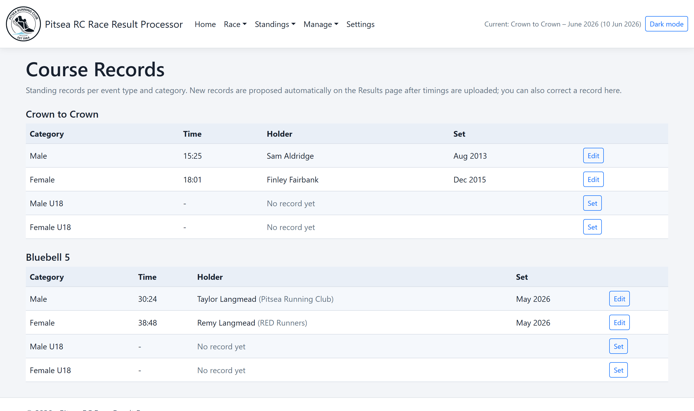
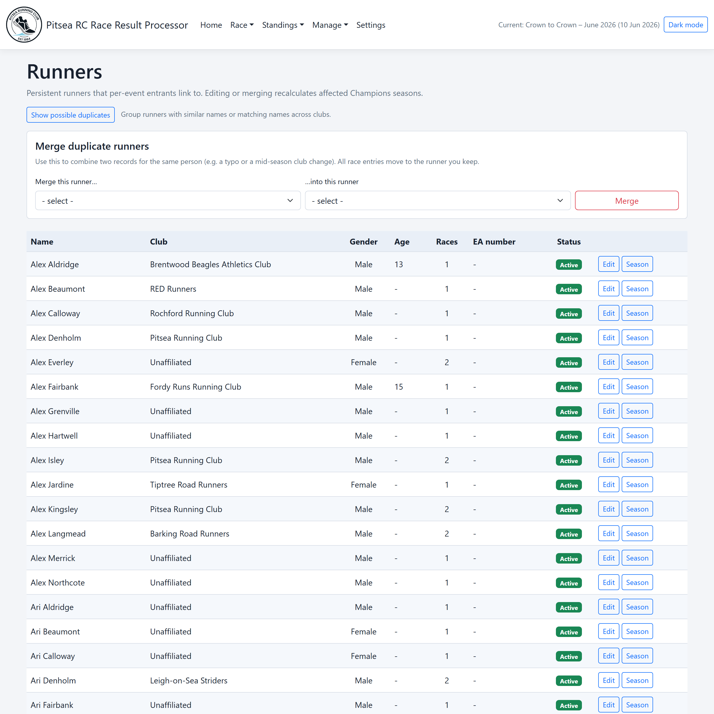
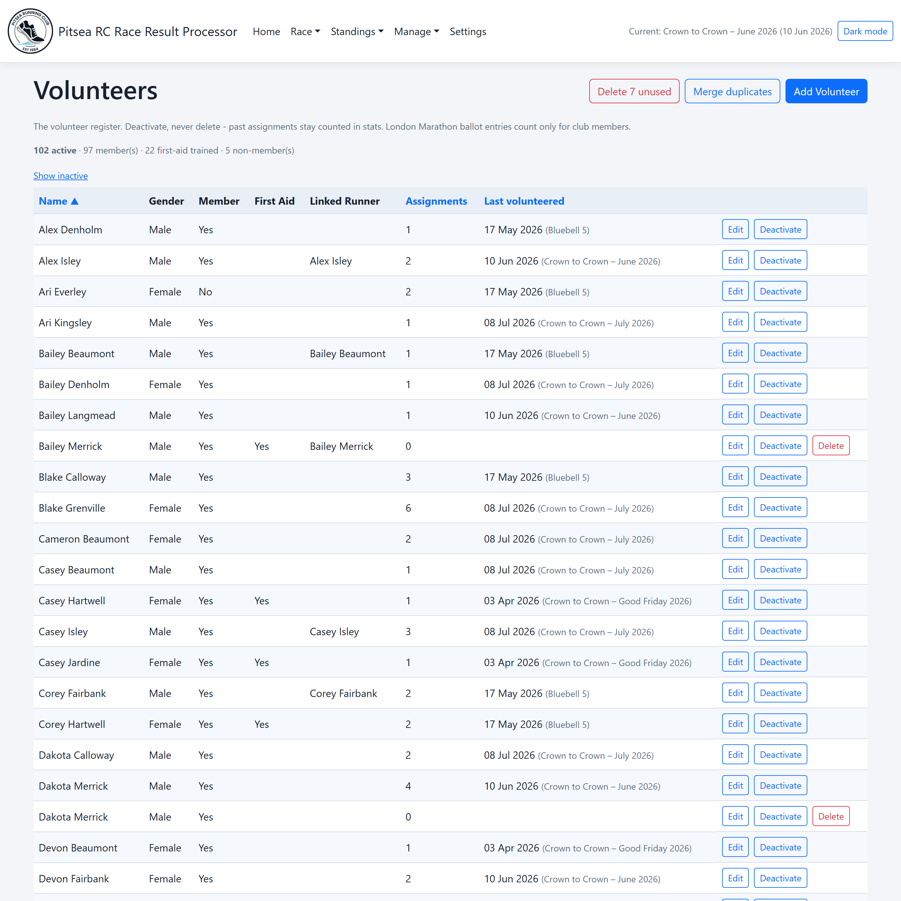
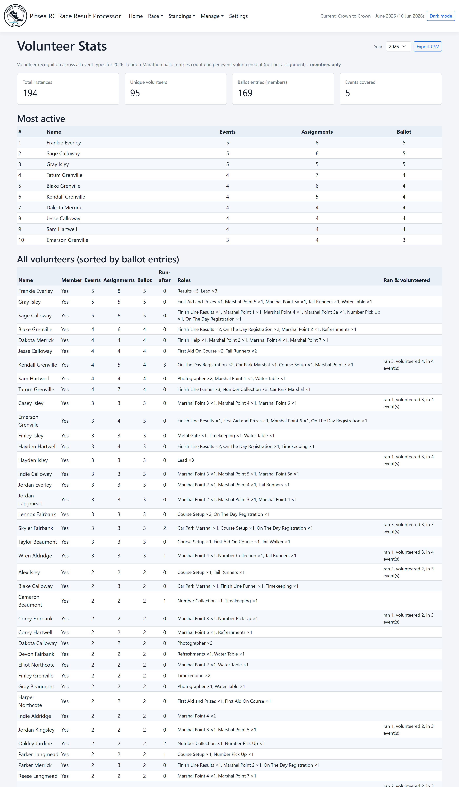
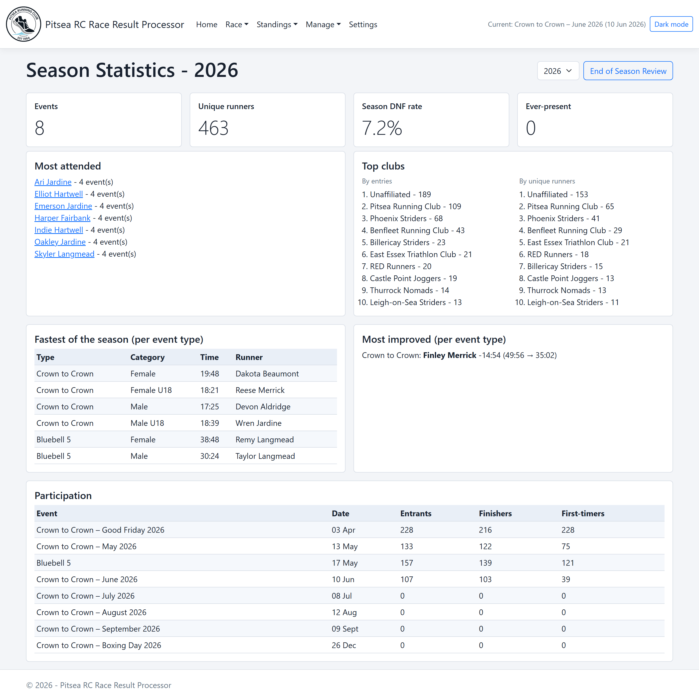
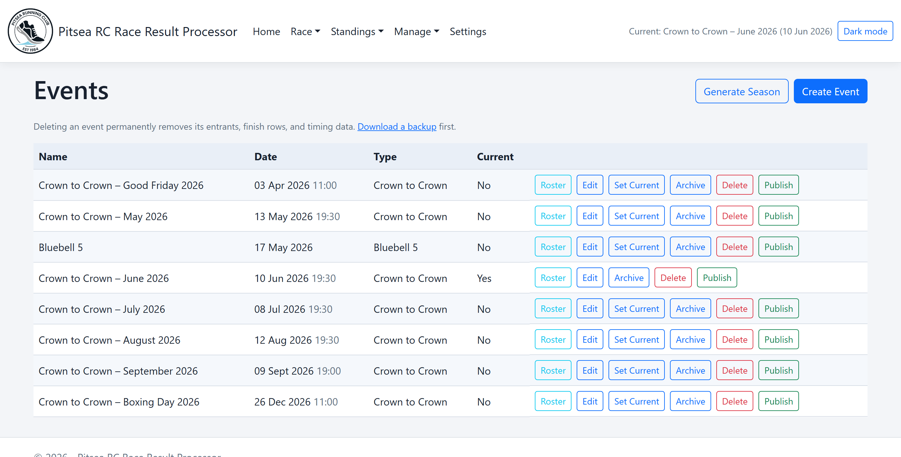
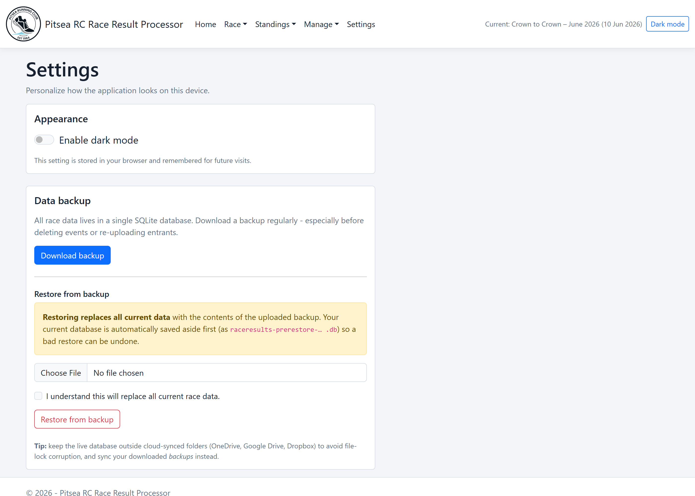
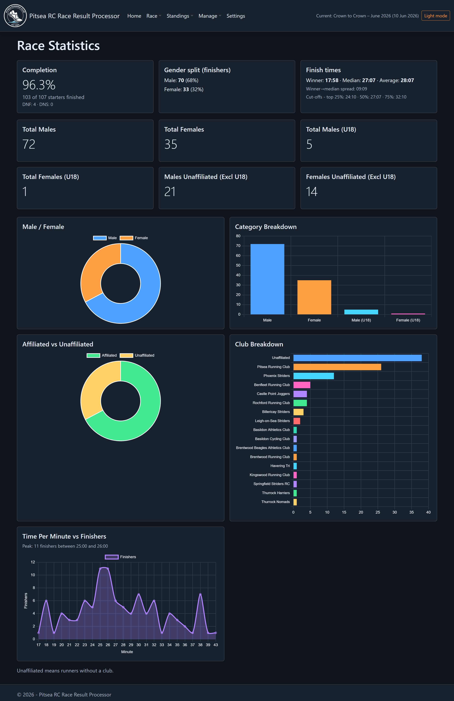

# Screenshots

A visual tour of the Pitsea RC Race Result Processor. See [Features](features.md) for the full capability list.

> **Note:** All names shown are anonymised demo data — every runner and volunteer name is a randomly generated pseudonym, and contact details have been removed. Club names, dates, times, and statistics come from a representative Crown to Crown event.

## Results & statistics

### Dashboard
The landing page shows the current event and live counts for entrants, finish rows, timing rows, and collated results.

### Collated results
All finishers in order with name, club, gender, age, time, and gap to the winner — plus a banner when a timing beats a standing course record. Edit any row or export to PDF/CSV.

### Race statistics
Completion rate, gender split, finish-time percentiles, and chart breakdowns for gender, category, club, affiliation, and finishers-per-minute.

### Top 10 by category
Top ten finishers for Male, Female, Male U18, and Female U18 (Vet Male / Vet Female on Bluebell events).

## Champions of Champions

### Leaderboard
Cumulative season scoring across the Crown to Crown series — top 10 per category earn points (10→1), with tie-break indicators (†) and multi-year navigation. Export to PDF or CSV.

### Course records
Records held per event type and category, with retained history and organiser-confirmed new-record detection.

## Runners & volunteers

### Runner registry
Persistent runners that per-event entrants link to, with race counts, editing, merging, and a possible-duplicates filter.

### Volunteer register
Persistent volunteers with gender, first-aid and club-member flags, an optional runner link, last-volunteered tracking, and merge.

### Volunteer roster
Per-event roster grouped by Leadership / Finish Area / Course, with the Crown to Crown roles seeded by default, restricted-role allow-lists, fill counts, double-booking warnings, auto-allocation, import, and PDF/Excel export.

### Volunteer statistics
Season recognition — total instances, unique volunteers, London Marathon ballot entries, a most-active leaderboard, and each volunteer's combined "ran X, volunteered Y" record.

## Season & administration

### Season statistics
A per-year dashboard covering most-attended and ever-present runners, top clubs, fastest per category, most improved, and participation trends.

### Event management
Create, edit, select current, archive, delete, and publish events, with a one-click season calendar generator.

### Settings
Theme toggle, plus database backup and restore.

### Dark mode
The whole app is theme-aware; the logo and charts adapt to the selected theme.

